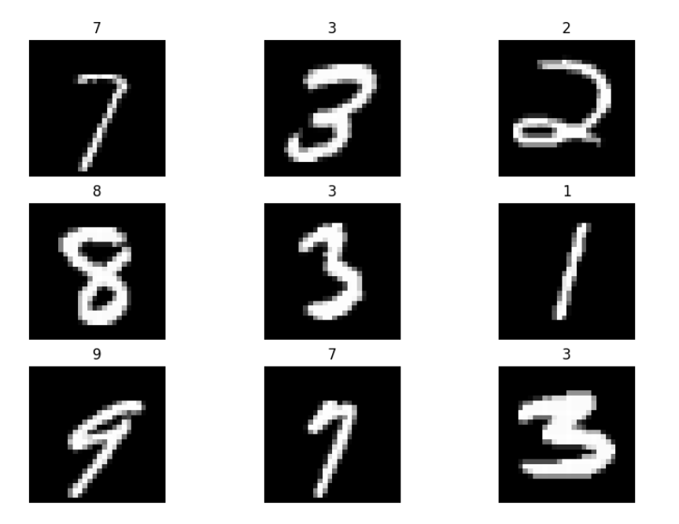

# Digit Recognizer

This is a Kaggle begginer competition based on the famous MNIST dataset. I managed to have a 98.17% test accuracy using Pytorch and a CNN architecture.

*Predicted labels with their corresponding images for 9 random samples*

- Link to Kaggle notebook: https://www.kaggle.com/code/icksir/98-17-digit-recognizer-with-pytorch